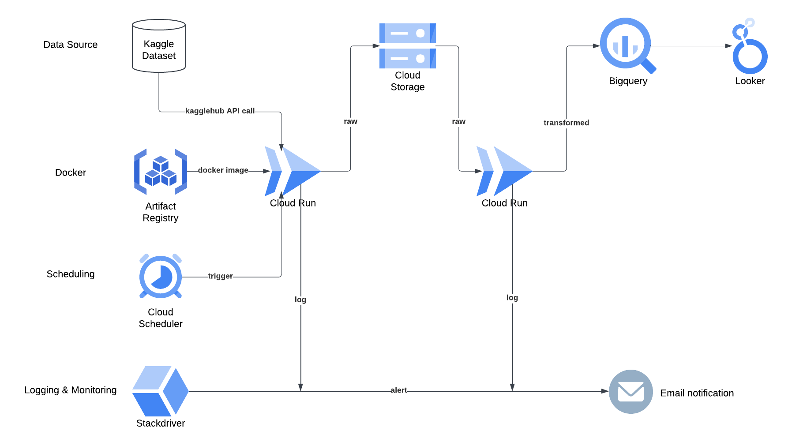

# Cloud Deployment

## stacks:

### Cloud Storage
Create a bucket for storing raw supermarket sales data file

### Artifact Registry
Create a gcr repo for uploading docker image of the ETL job that use src/etl.py as entrypoint

### Cloud Run Job
Configure a cloud run job with gcr docker image for execution

### Cloud Scheduler
Schedule the cloud run job to run in cadence via cloud run job's HTTP URL

### BigQuery
Before cloud run job execution, configure a BigQuery dataset and create 3 tables (customer, payment, invoice)

After cloud run job execution, use BigQuery console to run sql query for creating reports

### Looker Studio
Build looker dashboards from BigQuery tables for reporting and analysis

### Stackdriver Monitoring
Configure alerting from Cloud Run Job logs or route logs to BigQuery for building further monitoring dashboards

## Diagram

