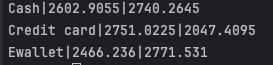

# Local Setup

## step 1 (installation):
### install sqlite3:
```shell
brew install sqlite3
```

### install necessary python package:
```shell
pip install -r requirements.txt
```

## step 2 (execution):
### run etl:
```shell
python3 src/etl.py
```

## step 3 (validation):
### open sqlite3: 
```shell
sqlite3 db/supermarket.db
```

### copy content from db/report.sql, paste in sqlite3 console and run

### you should see something like this:

screenshot:

